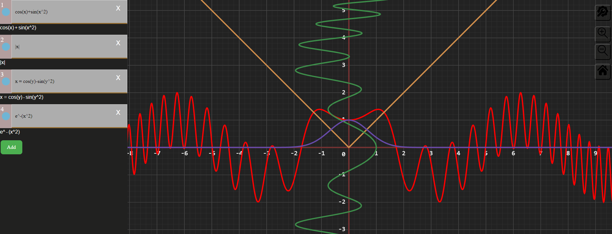
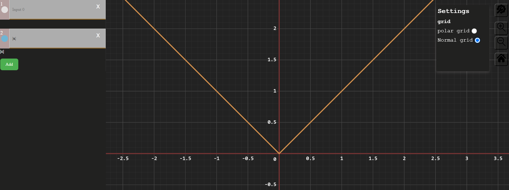
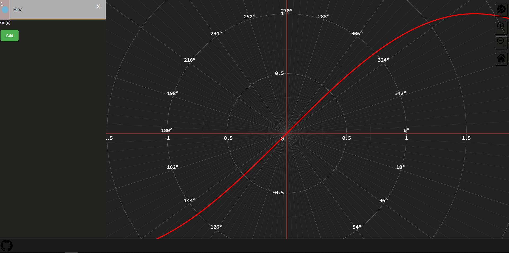
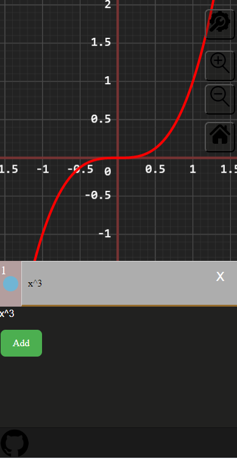

# graph calculator

## list support command

1. `sin(a)  cos(a)`
2. `tg(a)  ctg(a)`
3. `arctg(a)  arcctg(a)`
4. `x! (using~gamma~func)  x^n`
5. `abs(x)  |x|`
6. `sqrt(x) - Square root`
7. `ln(x)  log(x, n)`

### and math constans

1. pi
2. e

### Roadmap

- [x] scale wheel
- [x] home, scale buttons
- [x] mobile and adaptiv
- [x] polar grid
- [x] gamma function
- [x] different X and Y cords
- [ ] integrals
  - [ ] derivatives
- [ ] the equation with two variable

### screens

